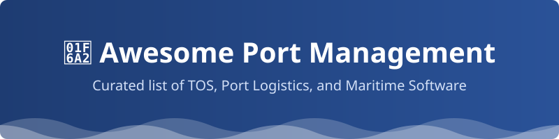

<!-- SEO Description: A comprehensive and curated list of SaaS products and open-source GitHub projects for Port Management, Terminal Operating Systems (TOS), and maritime logistics. Discover the best tools for container terminal simulation, yard planning, and vessel operations. -->

  

# 🚢 Awesome-Port-Management

  
  
  

## 🌟 Top Port Management Platforms Ecosystem

**Curated List of SaaS Products & Open-Source GitHub Projects** 🏆

*Focused on Terminal Operating Systems (TOS), Container Terminal Management, Yard Planning, Gate Operations, Vessel Planning & Port Logistics* 🏗️

**Last updated: August 2026** 📅

This repository tracks notable **SaaS platforms** and **open-source projects** for **Port Management / Terminal Operating Systems**. These tools help container terminals, bulk terminals, and port authorities manage vessel berthing, yard operations, equipment control, gate processing, cargo tracking, and overall terminal productivity. 🚀

**Examples** include Navis N4, PortPro, Tideworks Technology, Cargotec Kalmar One, PortX, Awake.AI, Portchain, PortVision, Terminal Operating System by TBA, and Identec Solutions (the category leaders). 🏢

**Open-source emphasis**: This section is heavily expanded with every major active project for port and container terminal simulation, maritime logistics modeling, cargo flow generation, and related open tools — ideal for researchers, smaller terminals, and developers seeking transparent alternatives or complementary components to commercial TOS platforms. 💻

Contributions welcome! Open a PR to add/update entries. Keep descriptions factual and link to official sites. 🤝

## 📑 Table of Contents

- [☁️ SaaS/Hosted Platforms](#%EF%B8%8F-saashosted-platforms)
- [🔓 Open-Source GitHub Projects](#-open-source-github-projects)
- [✍️ How to Contribute](#%EF%B8%8F-how-to-contribute)
- [⚠️ Disclaimer](#%EF%B8%8F-disclaimer)
- [📈 Star History](#-star-history)

## ☁️ SaaS/Hosted Platforms

| Platform | Description | Pricing | Free Tier Limit | Company Size (Valuation/Revenue) |
| :--- | :--- | :--- | :--- | :--- |
| **[Cargotec Kalmar One](https://www.kalmarglobal.com/)** 🏭 | Integrated automation and terminal operating platform designed for automated and semi-automated container terminals. | $300,000/year (Starting Tier) | 30-day free trial; limited to 1 automated equipment sandbox | ~$1B+ Revenue |
| **[Navis N4 (Kaleris)](https://kaleris.com/)** 🌍 | Leading enterprise Terminal Operating System for container terminals, covering vessel planning, yard optimization, equipment control, gate operations, and automation integration. | $250,000/year (Starting Tier) | 30-day free trial; limited to 1 terminal sandbox environment | ~$500M Valuation |
| **[Tideworks Technology](https://www.tideworks.com/)** ⚙️ | Established TOS solutions for container and mixed-cargo terminals with strong operational and EDI capabilities. | $150,000/year (Starting Tier) | 30-day free trial; limited to 1 facility simulation | ~$100M Revenue |
| **[TBA Group Terminal Operating System](https://www.tba.group/)** 🏗️ | Advanced TOS and emulation/simulation solutions used for both live operations and terminal design/optimization. | $100,000/year (Starting Tier) | 30-day free trial; limited to 1 emulation scenario | ~$100M Revenue |
| **[Identec Solutions](https://www.identecsolutions.com/)** 📡 | Technology provider specializing in real-time location, access control, and operational visibility solutions for ports and terminals. | $50,000/year (Starting Tier) | 30-day free trial; limited to 100 tracked tags | ~$50M Revenue |
| **[Portchain](https://www.portchain.com/)** ⛓️ | Berth planning and vessel schedule optimization platform that improves coordination between terminals and shipping lines. | $5,000/month (Starting Tier) | 30-day free trial; limited to 10 vessel schedules | ~$20M Valuation |
| **[PortX](https://www.portx.io/)** 🔗 | Digital platform supporting port and terminal collaboration, visibility, and operational efficiency. | $1,000/month (Starting Tier) | 14-day free trial; limited to 10,000 API transactions | ~$15M Valuation |
| **[PortPro](https://www.portpro.io/)** 🚚 | Modern cloud-based platform focused on drayage, terminal trucking, and port logistics coordination. | $500/month (Starting Tier) | 14-day free trial; limited to 50 active truck tracking sessions | ~$10M Valuation |
| **[Awake.AI](https://www.awake.ai/)** 🤖 | AI-powered maritime and port platform focused on just-in-time arrivals, situational awareness, and predictive operations. | $2,000/month (Starting Tier) | 14-day free trial; limited to 1 port area monitoring | ~$10M Valuation |
| **[PortVision](https://www.portvision.com/)** 🔭 | Vessel tracking and port intelligence solution providing real-time visibility into maritime traffic and terminal activity. | $100/month (Starting Tier) | 7-day free trial; limited to 5 concurrent vessels tracked | ~$5M Valuation |

## 🔓 Open-Source GitHub Projects

- **[eclipse/sumo](https://github.com/eclipse/sumo)**   
  Simulation of Urban MObility (SUMO) is an open source, highly portable, microscopic and continuous traffic simulation package designed to handle large road networks, widely used for port hinterland and logistics modeling. 🚗

- **[aws-samples/port-optimization](https://github.com/aws-samples/port-optimization)**   
  AWS sample implementations for port optimization and terminal operations planning, providing architectural patterns for smart ports. ☁️

- **[1kastner/conflowgen](https://github.com/1kastner/conflowgen)**   
  Open-source container flow generator that creates realistic synthetic container flow scenarios for terminal planning and simulation studies. 📦

- **[pyseidon-sim/pyseidon](https://github.com/pyseidon-sim/pyseidon)**   
  Open-source, data-driven maritime port simulator built with a modular entity-component approach for testing operational scenarios, berth policies, and resource allocation. 🛳️

- **[naval-group/LOTUSim](https://github.com/naval-group/LOTUSim)**   
  Open-source maritime simulator based on Gazebo, ROS, and Xdyn for surface, underwater, and multi-agent maritime scenarios. 🌊

- **[jenniferdavid/Gazebo_Harbour_Models](https://github.com/jenniferdavid/Gazebo_Harbour_Models)**   
  Open-source 3D models and environments for simulating container terminals, equipment, and autonomous operations in Gazebo. 🏭

- **[spartalab/port-simulation](https://github.com/spartalab/port-simulation)**   
  Modular discrete-event simulation framework for analyzing container, liquid bulk, and dry bulk terminal operations (MAPS – Multimodal Analysis Port Simulation). 📊

- **[AhmedAredah/TerminalSim](https://github.com/AhmedAredah/TerminalSim)**   
  High-performance open-source C++ simulation server for modeling container terminal operations, multimodal networks, and optimization analysis. 🖥️

- **[AhmedAredah/CargoNetSim](https://github.com/AhmedAredah/CargoNetSim)**   
  Open-source multimodal cargo network simulator covering maritime, rail, and road transportation with route optimization and scenario analysis capabilities. 🛤️

- **[WoutDeleu/PortTerminalSimulation](https://github.com/WoutDeleu/PortTerminalSimulation)**   
  Discrete-event simulation models focused on quay and yard container management, vessel scheduling, and what-if scenario testing. 🚢

- **[Scriptwall/cargomint](https://github.com/Scriptwall/cargomint)**   
  Open-source multi-tenant logistics operating system for shipment processing, fleet operations, manifests, and delivery workflows (adaptable to port hinterland logistics). 🚛

### 💡 Additional Strong Open-Source Options

- **Simulation & research**: PySeidon, TerminalSim, ConFlowGen, and related discrete-event models form the core of open port research tooling.
- **Multimodal logistics**: CargoNetSim and MAPS for broader cargo network and terminal studies.
- **Visualization & robotics**: Gazebo-based harbour models for equipment and automation testing.
- **Supporting logistics**: Open TMS and cargo management platforms that can integrate with terminal workflows.
- Many academic **berth allocation**, **yard optimization**, and **container terminal** simulation projects continue to appear on GitHub.

**Frameworks for building custom systems**: Combine **PySeidon or TerminalSim** for operational simulation, **ConFlowGen** for realistic demand generation, open AIS/maritime data tools, and custom optimization modules to create research-grade or prototype port management and terminal planning capabilities. 🛠️

## ✍️ How to Contribute

1. Fork the repo.
2. Add/edit entries in `README.md` (follow existing format).
3. Include: name, link, 1–2 sentence description, and whether it's SaaS or open-source.
4. Submit PR with a short explanation.

Star the repo if you find it useful! ⭐

## ⚠️ Disclaimer

- This is a **community-curated** list — not exhaustive and not an endorsement.
- Port and terminal systems manage critical infrastructure, safety, and high-value cargo; any operational deployment must meet strict regulatory, cybersecurity, and reliability standards.
- Self-hosted open-source solutions are primarily suited for research, simulation, training, and prototyping; production Terminal Operating Systems typically require certified commercial platforms and extensive integration.

---

**Made for port authorities, terminal operators, maritime logistics professionals, and researchers.** 🌐  
Let's make port and terminal management more open, simulation-driven, and collaborative.

## 📈 Star History

<a href="https://www.star-history.com/?repos=ishandutta2007%2FAwesome-Port-Management&type=date&legend=bottom-right">
<picture>
<source media="(prefers-color-scheme: dark)" srcset="https://api.star-history.com/chart?repos=ishandutta2007/Awesome-Port-Management&type=date&theme=dark&legend=bottom-right" />
<source media="(prefers-color-scheme: light)" srcset="https://api.star-history.com/chart?repos=ishandutta2007/Awesome-Port-Management&type=date&legend=bottom-right" />

</picture>
</a>

